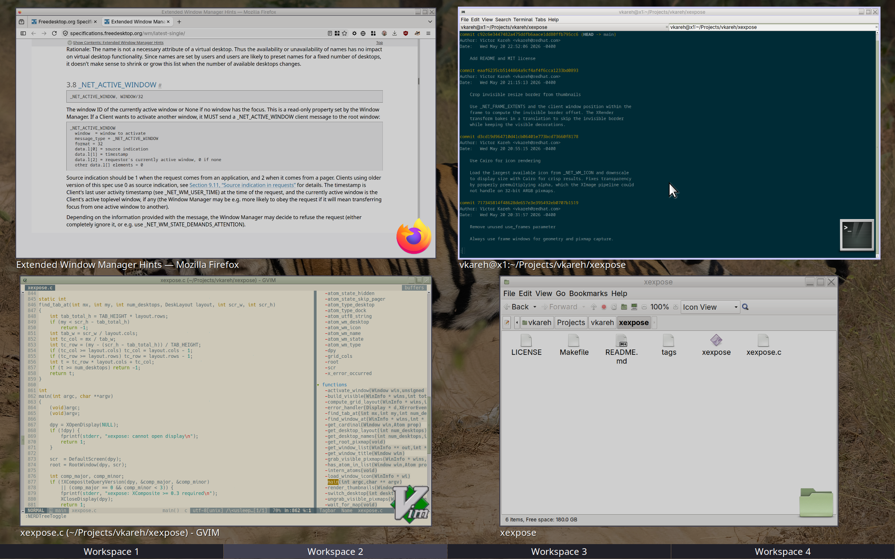

# xexpose

A lightweight window picker for X11. Shows live thumbnails of all windows in a grid overlay, letting you quickly switch between them.

Should work with any EWMH-compliant X11 window manager like marco, metacity, kwin, xfwm4, openbox, compiz, fluxbox, i3, awesome, bspwm, herbstluftwm.



## Features

- Live window thumbnails via XComposite
- Workspace tabs with spatial navigation matching your desktop layout
- Keyboard navigation (arrows, Tab, Enter, Escape, PgUp/PgDn)
- Type-to-filter: narrow windows by title as you type
- Alt-Tab-like cycling (hold Super, press Tab to cycle, release to activate)
- Mouse hover selection with click to activate
- Application icons overlaid on thumbnails
- Desktop wallpaper as dimmed backdrop
- Sticky window support with visual indicator
- Urgent window support with visual indicator
- Minimized windows shown in a separate row with semi-transparent placeholders

## Dependencies

- Xlib, XComposite (>= 0.3), XRender, Xfixes, Xft
- Cairo (with Xlib support)

On Fedora:

```
dnf install libX11-devel libXcomposite-devel libXrender-devel libXfixes-devel libXft-devel cairo-devel
```

On Debian/Ubuntu:

```
apt install libx11-dev libxcomposite-dev libxrender-dev libxfixes-dev libxft-dev libcairo2-dev
```

## Building

```
make
sudo make install
```

## Usage

```
xexpose [-a|--all] [--allow-close] [--hide-minimized]
```

| Option | Description |
|--------|-------------|
| `-a`, `--all` | Show windows from all workspaces in a single grid |
| `--allow-close` | Enable middle-click to close windows |
| `--hide-minimized` | Exclude minimized windows from the picker |

Bind it to a key in your window manager for quick access. For example, in marco:

```
gsettings set org.mate.Marco.keybinding-commands command-1 'xexpose'
gsettings set org.mate.Marco.global-keybindings run-command-1 '<Super>Tab'
```

### Controls

| Key | Action |
|-----|--------|
| Arrow keys | Navigate between window thumbnails |
| Tab / Shift+Tab | Cycle through windows (wraps around) |
| Enter | Activate selected window |
| Delete | Close selected window (requires `--allow-close`) |
| Type characters | Filter windows by title |
| Backspace | Remove last filter character |
| Ctrl+Backspace | Clear filter |
| Escape | Close picker |
| PgUp / PgDn | Switch workspace |
| Down (from bottom row) | Enter workspace tab navigation |
| Super hold + Tab | Cycle windows, release Super to activate |
| Mouse click | Activate clicked window or switch workspace tab |
| Middle-click | Close window (requires `--allow-close`) |
| Mouse hover | Highlight window or tab |

### X Resources

Appearance can be customized via `~/.Xresources`:

```
xexpose.foreground:     #eeeeec
xexpose.background:     #2e3436
xexpose.borderColor:    #555753
xexpose.highlightColor: #eeeeec
xexpose.stickyColor:    #edd400
xexpose.urgentColor:    #ef2929
xexpose.font:           sans-10
```

Reload with `xrdb -merge ~/.Xresources`. Wildcard resources like `*foreground` are also respected.

## License

MIT
